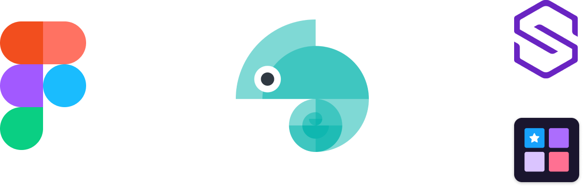

<div id="top"></div>

<!-- PROJECT LOGO -->
<br />
<div align="center">
    

  <h3 align="center">Suzy Style Dictionary</h3>
</div>

<!-- ABOUT THE PROJECT -->

## About The Project

This project provides the configuration and scripts to receive design tokens from our Figma design systems and translate them to our different platforms in the Suzy product ecosystem.

It receives exported design token JSON files from the Figma Tokens plugin and builds out the 'ready-to-use' style variables and file formats for different platforms (iOS, Android and Web).

<p align="right">(<a href="#top">back to top</a>)</p>

### Built With


<p align="right">(<a href="#top">back to top</a>)</p>

<!-- GETTING STARTED -->

## Getting Started

Download this repository and do the following steps to get started:

### Prerequisites

You can use `npm` or `yarn` to install your packages.

- npm
  ```sh
  npm install npm@latest -g
  ```
- yarn
  ```sh
  yarn install yarn@latest -g
  ```

### Installation

1. Clone the repo
   ```sh
   git clone https://github.com/brockp/suzy.style.dictionary.git
   ```
2. Install NPM/Yarn packages
   ```sh
   npm install or yarn install
   ```
3. Ensure your design token JSON files are in the `src/{folder}`, they are:

   - `brands` = brand specific tokens
   - `globals` = global tokens across all brands
   - `platforms` = platform specific tokens (iOS, Android, Web)

4. Run the style dictionary
   ```sh
   npm run build
   ```
5. Review `dist` directory for style files output format

- Currently supported outputs:
  - Sass, CSS, JavaScript, iOS plist, Android XML, JSON

<p align="right">(<a href="#top">back to top</a>)</p>

<!-- ROADMAP -->

## Roadmap

- [ ] Add Changelog
- [ ] Add Additional Templates w/ Examples

<p align="right">(<a href="#top">back to top</a>)</p>
